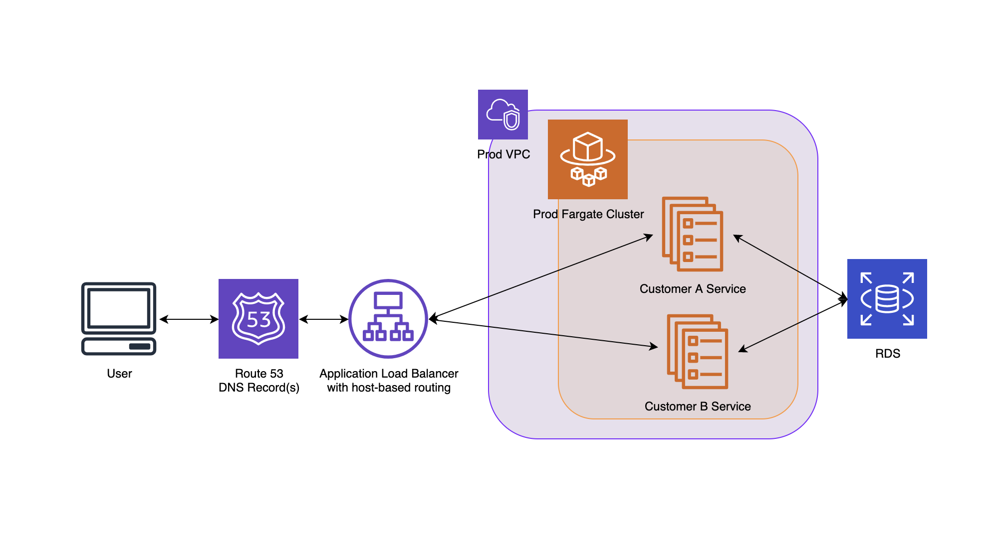

# Fargate Demo

## Introduction

This repository is a POC for how one might create an ECS Fargate Cluster with multiple services, and use
an Application Load Balancer and Host-Based routing to route traffic for multiple clients.

The repo consists of three CloudFormation stacks:

1. Fargate Cluster
2. Public-facing Application Load Balancer
3. Fargate services - Deploy this twice, once for each service



This Architecture Example shows what this template will create, as well as additional services not included in this template. The RDS connection will need to be configured manually at this time. An existing VPC with public and private subnets is a prerequisite to this set of templates. These templates are not nested and require manual updates to parameter files.

### Prerequisites

1. Push your desired Docker image to ECR.

2. Determine the VPC in which you wish to deploy the Fargate service. If you would like some pointers for VPC planning and creation, check out [this repository](https://github.com/1Strategy/vpc-starter-template).

3. Create/select a hosted zone and TLS certificate to use for this project.

4. Modify the Parameters file for each stack in `parameters/<aws region>` to match  AWS resources.

## How to Deploy

### Fargate Cluster

This is a Fargate cluster to host app services. Run this command first to create a new Fargate Cluster.

```shell
aws cloudformation deploy --template-file ./templates/fargate-cluster.yaml --stack-name "$USER"-ECS-cluster --parameter-overrides $(cat ./parameters/us-west-2/cluster.ini) --capabilities CAPABILITY_IAM
```

### App Load Balancer

This is public-facing application load balancer. Run this command second.

```shell
aws cloudformation deploy --template-file ./templates/alb-external.yaml --stack-name "$USER"-ECS-LoadBalancer --parameter-overrides $(cat ./parameters/us-west-2/alb-external.ini)
```

### Customer1 Service

After creating the first two templates, update the customer1.ini file with outputs from the ALB stack and the Cluster stack. Then, use this command to create a Fargate service named Customer1.

```shell
aws cloudformation deploy --template-file ./templates/ecs-service.yaml --stack-name "$USER"-Customer1-service --parameter-overrides $(cat ./parameters/us-west-2/customer1.ini)
```

### Customer2 Service

The Customer2 service is nearly identical to the Customer1 Service. It can be deployed using this command:

```shell
aws cloudformation deploy --template-file ./templates/ecs-service.yaml --stack-name "$USER"-Customer2-service --parameter-overrides $(cat ./parameters/us-west-2/customer2.ini)
```
